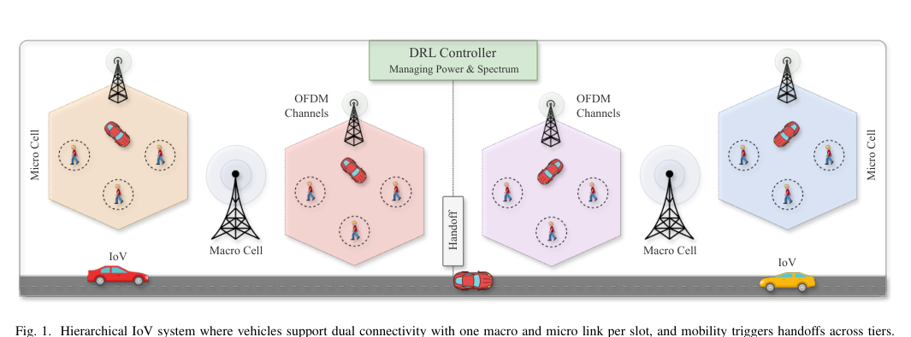
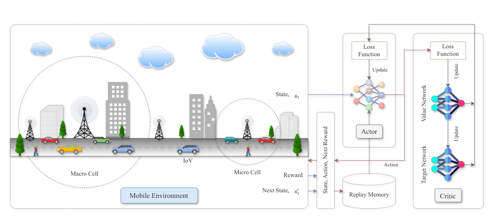
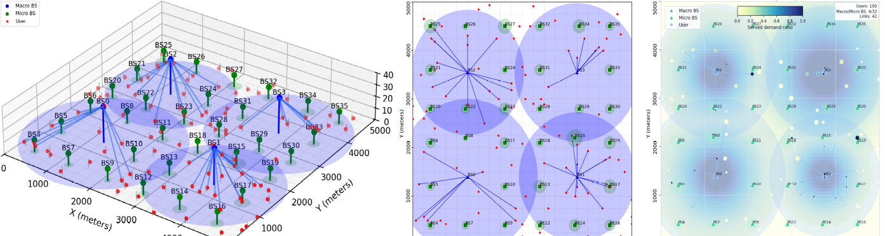
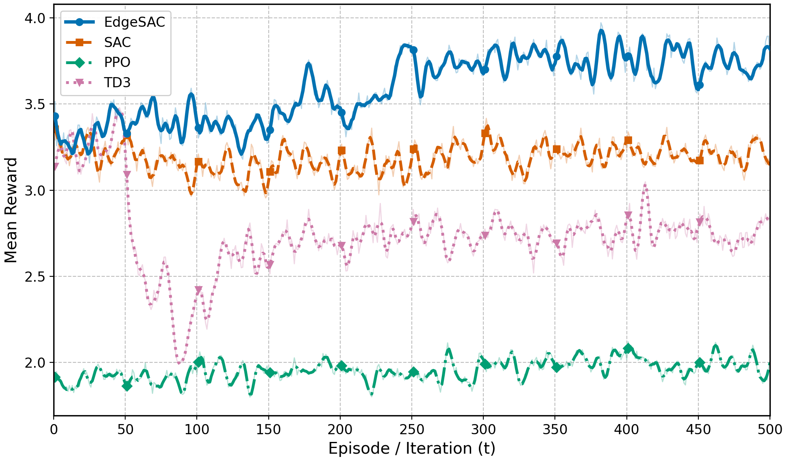
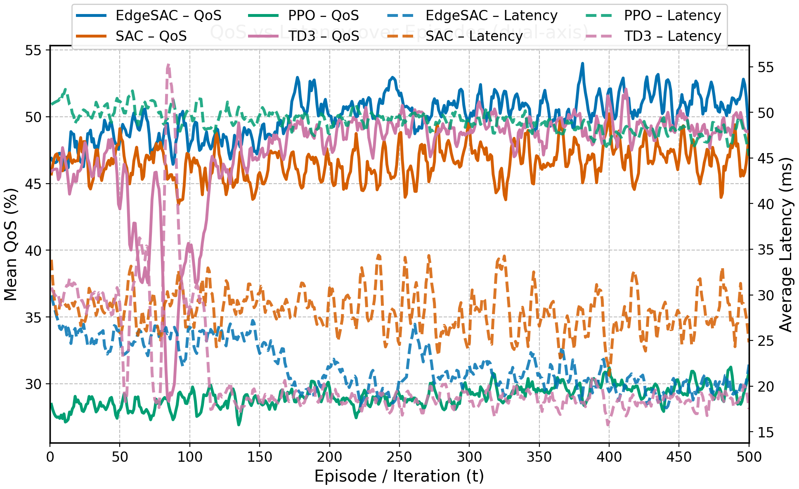
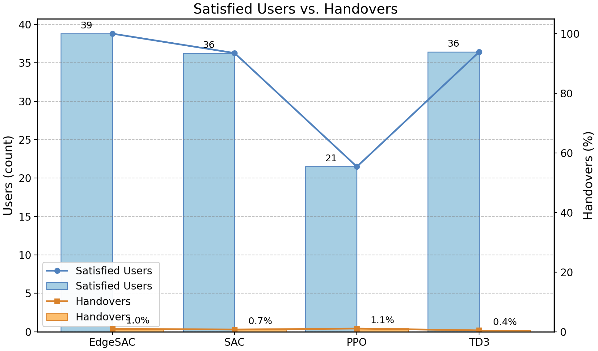
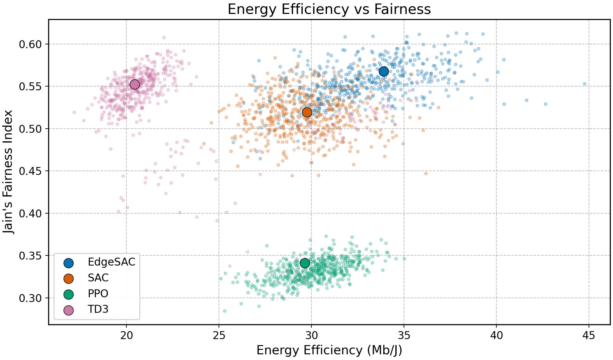

<h1 align="center">EdgeSAC: Graph Neural Soft Actor-Critic for Hierarchical IoV Resource Management</h1>

<p align="center">
  
  
  
  
  
</p>

<p align="center">
  Repository for the paper <strong>“EdgeSAC: Graph Neural Soft Actor-Critic for Hierarchical IoV Resource Management.”</strong>
</p>

<div align="justify">

EdgeSAC studies <strong>joint transmit-power and channel-reservation control</strong> for a hierarchical <strong>5G NR Internet of Vehicles (IoV)</strong> network with <strong>macro/micro tiers</strong>, <strong>dual connectivity</strong>, <strong>graph-aware reinforcement learning</strong>, and <strong>NR/MIMO-consistent link modeling</strong>.

The core idea is to represent the radio network as a <strong>graph of base stations</strong>, let a <strong>graph-aware Soft Actor-Critic (SAC)</strong> agent output <strong>continuous per-site control actions</strong>, and then map those actions into feasible radio decisions using an <strong>on-demand scheduler</strong> and <strong>water-filling power allocation</strong>. This keeps the control space continuous while still respecting practical constraints such as finite channel pools, tier budgets, coverage, and the rule that each user can hold <strong>at most one macro and one micro link per slot</strong>.

</div>

---

## Overview

<div align="justify">

Hierarchical IoV resource management is difficult because several objectives are tightly coupled: throughput must remain high under dense interference, power consumption must remain controlled, latency must stay low under mobility, fairness and satisfaction must remain stable as load changes, and all decisions must respect finite radio resources and dual-connectivity limits.

EdgeSAC addresses this by combining graph-aware interference reasoning across macro and micro base stations, continuous-action SAC for per-site control, scheduler-aligned reservation and admission, Shannon-with-gap plus rank-adaptive MIMO for NR-consistent evaluation, and realistic urban mobility and propagation modeling for reproducible experiments. Compared with non-graph or non-scheduler-aware baselines, the method is designed to better align learning with what the network actually does at run time.

</div>

---

## What Makes EdgeSAC Different

- **Graph-aware SAC** instead of treating each base station independently
- **Continuous per-base-station control** instead of coarse action discretization
- **Dual-tier scheduling** with at most one macro and one micro link per user
- **On-demand channel activation** instead of blanket reservation
- **Water-filling power split** across active channels
- **3GPP-style UMa/UMi propagation** with Manhattan mobility
- **NR-consistent Shannon-with-gap rate mapping** with **rank-adaptive MIMO**
- **Strong experiment logging** for reward, QoS, latency, fairness, handover, energy, and utilization

---

## Visual Overview

### 1) Hierarchical IoV system model

<div align="justify">

This figure shows the two-tier deployment used in the paper. Macro cells provide wide-area service, micro cells densify capacity, and vehicles may simultaneously keep <strong>one macro link and one micro link</strong>. The controller manages power and spectrum while mobility triggers handoffs.

</div>



### 2) EdgeSAC learning and control pipeline

<div align="justify">

This figure shows the main control loop. The environment produces the current state, reward, and next state; the graph-aware SAC agent outputs per-site actions; replay memory stores transitions; and actor/critic/value networks are updated from sampled experience.

</div>



---

## Unified System View

```text
Vehicular mobility + traffic demand
              |
              v
Hierarchical IoV environment
(macro tier + micro tier + carrier pools + mobility + PHY)
              |
              v
Base-station graph construction
(node features + edge features)
              |
              v
EdgeSAC agent
(ENGNN actor + graph critics + value network)
              |
              v
Continuous per-BS actions
[power fraction, reservation fraction]
              |
              v
On-demand scheduler
(coverage-aware association, dual connectivity, channel admission)
              |
              v
Water-filling power allocation + SINR/rate evaluation
              |
              v
Reward, diagnostics, replay memory, network updates
```

<div align="justify">

This design is important because the agent does <strong>not</strong> directly assign users to channels one by one. Instead, it outputs <strong>continuous control signals per base station</strong>, and the environment converts them into feasible scheduling and power-allocation decisions.

</div>

---

## Method Summary

### Action space

<div align="justify">

For each base station <code>b</code>, the policy outputs a <strong>2D continuous action</strong>.

</div>

- `action[b, 0]` → **power fraction**
- `action[b, 1]` → **channel / reservation fraction**

<div align="justify">

These are mapped to transmit power under per-tier budgets, reserved channel counts under carrier availability, user admission under macro/micro constraints, and per-channel power allocations via water-filling.

</div>

### State representation

<div align="justify">

The environment provides a <strong>per-base-station observation tensor</strong>. In the simulation code, the observation has shape:

</div>

```python
(num_base_stations, 13)
```

<div align="justify">

The agent then augments this with type information (<code>macro</code> vs <code>micro</code>) and builds a static graph over base-station locations.

</div>

### Scheduler rule

- **at most one macro link**, and
- **at most one micro link**

<div align="justify">

can be assigned to a user in one time slot. This keeps the control problem practical and aligns the learning interface with the actual scheduler.

</div>

### Reward objective

```python
reward = 10.0 * util - 2.0 * power_norm
```

<div align="justify">

Here, <code>util</code> measures served demand relative to requested demand, while <code>power_norm</code> is normalized total transmit power.

</div>

---

## Architecture Details

<div align="justify">

The paper and code together imply the following architecture.

</div>

### 1) Environment-side modeling

- macro and micro base stations
- users with mobility
- carrier-specific channel pools
- coverage updates from link-budget calculations
- load-aware association
- dual connectivity constraints
- water-filling power allocation
- SINR/rate/latency evaluation
- reward and diagnostic generation

### 2) Graph construction

- **nodes** represent base stations
- **edges** connect nearby interacting sites
- **node features** summarize power, utilization, demand, mobility, and interference proxies
- **edge features** summarize distance, carrier match, tier pairing, and local contrasts

### 3) Graph-aware actor and critics

<div align="justify">

The proposed method uses a graph-aware policy backbone instead of treating each base station independently. The graph encoder provides a structured way to reason about interference coupling and neighbor interactions.

</div>

### 4) PHY-consistent evaluation

- **3GPP-style UMa / UMi path loss**
- **Shannon-with-gap rate mapping**
- **256-QAM spectral-efficiency cap**
- **NR overhead factor**
- **rank-adaptive MIMO**
- **water-filling** over active channels

---

## Code Tour

<div align="justify">

This section explains the repository through actual code structure and key code fragments. The goal is to help a reader understand not only <em>what</em> each part does, but also <em>how</em> the code is organized around base stations, channels, users, scheduling, rendering, and the RL interaction loop.

</div>

### Core simulation objects

#### `Channel`

<div align="justify">

A `Channel` is the smallest radio resource object used in the environment. It stores carrier information, bandwidth, noise figure, the attached base station, and the users currently occupying the channel.

</div>

```python
class Channel:
    def __init__(self, id, frequency, bandwidth, noise_figure_db=7.0):
        self.id = id
        self.frequency = frequency
        self.bandwidth = bandwidth
        self.users = []
        self.base_station = None
        self.temperature = 293.15
        self.noise_figure_db = noise_figure_db

    def calculate_noise_power(self):
        k = 1.38e-23
        N = k * self.temperature * self.bandwidth
        NF = 10.0**(self.noise_figure_db / 10.0)
        return N * NF
```

<div align="justify">

This makes the channel more than a simple counter. It is the concrete object used later for thermal noise, SINR, rate evaluation, and channel occupancy.

</div>

#### `BaseStation`

<div align="justify">

A `BaseStation` is the main controllable radio entity. The agent does not directly control users; it controls base stations, and each base station then reserves channels, updates coverage, and participates in scheduling.

</div>

```python
class BaseStation:
    def __init__(self, id, transmit_power, height, location, type_bs):
        self.id = id
        self.transmit_power = transmit_power
        self.height = height
        self.type_bs = type_bs      # 'Ma' or 'Mi'
        self.location = np.array(location, dtype=float)
        self.users = []
        self.assigned_channels = []
        self.coverage_area = 0.0
        self.per_channel_power = {}
```

```python
def assign_channels(self, num_channels, available_channels):
    num_channels = min(num_channels, len(available_channels))
    self.assigned_channels = available_channels[:num_channels]
    for ch in self.assigned_channels:
        ch.base_station = self
```

```python
def update_coverage_area_from_power(self, transmit_power_mW, frequency_hz):
    ...
    self.coverage_area = self.find_distance_for_path_loss(path_loss_budget_dB, frequency_hz)
    ...
    return self.coverage_area
```

<div align="justify">

In practical terms, a base station stores its site-level state and performs key infrastructure computations such as path loss, coverage update, channel reservation, and per-channel power bookkeeping after water-filling.

</div>

#### `User`

<div align="justify">

A `User` represents a mobile IoV node or vehicle. It stores mobility state, current demand, assigned channels, experienced SINR values, and the resulting throughput and latency.

</div>

```python
class User:
    def __init__(self, id, location, velocity, demand):
        self.id = id
        self.location = np.array(location, dtype=float)
        self.velocity = np.array(velocity, dtype=float)
        self.channel = []
        self.channel_SINR = []
        self.data_rate = 0
        self.data_rate_ma = 0
        self.data_rate_mi = 0
        self.demand = demand
        self.speed = np.linalg.norm(velocity)
```

```python
def calculate_data_rate(self):
    self.data_rate_ma = 0.0
    self.data_rate_mi = 0.0
    for i, ch in enumerate(self.channel):
        bw_eff = ch.bandwidth * NR_OVERHEAD
        SINR_dB = self.channel_SINR[i]
        max_rank = MIMO_MAX_RANK[ch.base_station.type_bs]
        L, total_se = mimo_rank_and_total_se(SINR_dB, max_rank, gap_db=SNR_GAP_DB, max_se=MAX_SE)
        dr_Mbps = (bw_eff * total_se) / 1e6
```

```python
def calculate_latency(self):
    if not self.channel:
        return 100.0
    avg_d = np.mean([np.linalg.norm(self.location - ch.base_station.location) for ch in self.channel])
    prop_delay = (avg_d / 3e8) * 1e3
    proc_delay = 0.5
    sched_delay = 0.5
    num_users_on_channel = sum(len(ch.users) for ch in self.channel) / len(self.channel)
    queue_delay = 0.5 + num_users_on_channel / (self.data_rate + 1e-6)
    return float(np.clip(prop_delay + proc_delay + sched_delay + queue_delay, 0.0, 100.0))
```

<div align="justify">

So, the `User` object is where network decisions become visible as experienced service quality.

</div>

#### `MobileNetwork`

<div align="justify">

`MobileNetwork` is the main Gymnasium environment. It combines base stations, users, channels, mobility, the observation/action interfaces, the scheduler, the reward function, and the diagnostics returned to the agent.

</div>

```python
class MobileNetwork(gym.Env):
    metadata = {"render_modes": ["human"], "render_fps": 30}

    def __init__(self, num_base_stations, num_users, num_channels, area_size, bs_loc, ...):
        super().__init__()
        ...
        self.base_stations = [
            BaseStation(i, self.transmit_power[i], self.height[i], bs_loc[i], self.type_bs[i])
            for i in range(num_base_stations)
        ]
        ...
        self.action_space = spaces.Box(low=low, high=high, dtype=np.float32)
        self.observation_space = spaces.Box(low=0.0, high=1.0, shape=(num_base_stations, 13), dtype=np.float32)
```

<div align="justify">

This is the object the RL algorithm actually calls through `reset()` and `step(action)`.

</div>

### The control interface in code

<div align="justify">

The environment uses one 2D action per base station: one value for transmit power and one value for reserved channels.

</div>

```python
low = np.array([[0.001, 0.001]] * num_base_stations, dtype=np.float32)
high = np.array([[1.0, 1.0]] * num_base_stations, dtype=np.float32)
self.action_space = spaces.Box(low=low, high=high, dtype=np.float32)
self.observation_space = spaces.Box(low=0.0, high=1.0, shape=(num_base_stations, 13), dtype=np.float32)
```

```python
# action[i, 0] -> power fraction
# action[i, 1] -> channel fraction
```

<div align="justify">

This is one of the clearest parts of the design: the policy outputs continuous site-level control, not discrete user-by-user assignments.

</div>

### Macro and micro channel pools

<div align="justify">

The environment explicitly creates separate macro and micro channel pools. This makes carrier separation, bandwidth, and tier-specific resource limits visible in code.

</div>

```python
self.macro_carrier_frequencies = [3.5e9] if MACRO_REUSE_ONE else [3.4e9, 3.5e9, 3.6e9, 3.7e9, 3.8e9]
self.micro_carrier_frequencies = [24.5e9, 25.5e9, 26.5e9, 27.5e9, 28.5e9]
```

```python
for f in self.macro_carrier_frequencies:
    for _ in range(num_channels_per_carrier_ma):
        self.macro_channels.append(Channel(ch_id, f, macro_bw_hz, noise_figure_db=7.0))
        ch_id += 1

for f in self.micro_carrier_frequencies:
    for _ in range(num_channels_per_carrier_mi):
        self.micro_channels.append(Channel(ch_id, f, micro_bw_hz, noise_figure_db=9.0))
        ch_id += 1
```

### On-demand scheduler in code

<div align="justify">

One of the most important pieces of logic is the scheduler. It enforces the practical rule that a user can receive at most one macro link and at most one micro link in a slot.

</div>

```python
def assign_channels_on_demand(self, max_macro_per_user=1, max_micro_per_user=1):
    for u in self.users:
        u.clear_channel()

    # Phase A: every user gets at most one macro
    for u in self.users:
        bs_ma, _ = self._best_bs_in_cov(u, type_filter='Ma')
        if bs_ma:
            ch = bs_ma.find_available_channel()
            if ch:
                u.channel.append(ch)
                ch.users.append(u)

    # Phase B: users inside any micro coverage get exactly one micro
    for u in self.users:
        have_mi = any(c.base_station.type_bs == 'Mi' for c in u.channel)
        if have_mi:
            continue
        bs_mi, _ = self._best_bs_in_cov(u, type_filter='Mi')
        if bs_mi:
            ch = bs_mi.find_available_channel()
            if ch:
                u.channel.append(ch)
                ch.users.append(u)
```

<div align="justify">

This code fragment is the operational version of the problem statement in the paper.

</div>

### One environment step in code

<div align="justify">

The `step()` function is where the whole system comes together.

</div>

```python
def step(self, action):
    action = np.clip(action, self.action_space.low, self.action_space.high)
    power_fraction = action[:, 0]
    channel_fraction = action[:, 1]

    for u in self.users:
        u.clear_channel()
    for bs in self.base_stations:
        bs.clear_assigned_channels()
```

```python
for i, bs in enumerate(self.base_stations):
    if bs.type_bs == 'Ma':
        bs.transmit_power = float(power_fraction[i]) * self.ma_transmission_power
    else:
        bs.transmit_power = float(power_fraction[i]) * self.mi_transmission_power
```

```python
req_ch = int(np.rint(float(channel_fraction[i]) * max_cap))
req_ch = int(np.clip(req_ch, 0, len(avail_pool)))
if req_ch == 0 and len(avail_pool) > 0 and bs.transmit_power > 1e-6:
    req_ch = 1
```

```python
self.assign_channels_on_demand(max_macro_per_user=1, max_micro_per_user=1)
```

<div align="justify">

The meaning is straightforward: the policy chooses per-site power and per-site reservation, the environment maps those into actual resources, and then users are scheduled under dual-connectivity constraints.

</div>

### Water-filling in code

<div align="justify">

After association, site power is redistributed across active channels using water-filling instead of naive equal splitting.

</div>

```python
@staticmethod
def _waterfill(P_total, h_list, n_list, p_floor_list=None, tol=1e-6, max_it=60):
    ...
    for _ in range(max_it):
        mid = 0.5*(lo+hi)
        p = alloc(mid)
        s = float(np.sum(p))
        ...
    return list(np.maximum(alloc(hi), 0.0))
```

```python
p_list = self._waterfill(P_total, H, N, p_floor_list=floors, tol=1e-6, max_it=60)
for ch, p in zip(ch_act, p_list):
    bs.per_channel_power[ch.id] = float(max(p, 0.0))
```

<div align="justify">

This is important because it keeps power allocation synchronized with scheduling and link quality.

</div>

### Reward and diagnostics in code

<div align="justify">

The reward directly follows the utility-versus-power tradeoff used by the environment.

</div>

```python
served = sum(min(u.data_rate, u.demand) for u in self.users)
total_demand = sum(u.demand for u in self.users) + 1e-9
util = served / total_demand

budget_mW = n_ma * self.ma_transmission_power + n_mi * self.mi_transmission_power
power_norm = total_power / max(budget_mW, 1e-9)

reward = 10.0 * util - 2.0 * power_norm
reward = float(np.clip(reward, -10.0, 10.0))
```

```python
info = {
    'total_data_rate': total_data_rate,
    'avg_rate': avg_rate,
    'total_power': total_power,
    'energy_eff_Mb_per_J': energy_eff_Mb_per_J,
    'avg_latency': float(np.mean(user_latencies)) if user_latencies else 100.0,
    'satisfied_users': satisfied_users_count,
    'jain_fairness': jain,
    'handover_rate': handover_rate,
    'qos_mean': qos_mean,
    'util': util,
    'power_norm': power_norm,
}
```

<div align="justify">

So the environment is not only a reward generator. It is also an analysis tool that logs fairness, latency, handovers, coverage, outage, and utilization statistics.

</div>

### Rendering in code

<div align="justify">

The simulation rendering is directly tied to the code and is therefore placed here in the code tour. The `render()` method draws the Manhattan road grid, base-station coverage circles, BS markers, users, and the current active links.

</div>

```python
def render(self, mode='human', action=None):
    if self.render_mode != "human" or self.ax is None:
        return
    self.ax.clear()
    if self.mobility_model == "manhattan":
        for x in self.grid_xs:
            self.ax.plot([x, x], [0, self.area_size[0]], linestyle=':', linewidth=0.5, alpha=0.3, color='gray')
        for y in self.grid_ys:
            self.ax.plot([0, self.area_size[0]], [y, y], linestyle=':', linewidth=0.5, alpha=0.3, color='gray')
    for bs in self.base_stations:
        color = 'blue' if bs.type_bs == 'Ma' else 'green'
        circle = Circle(bs.location, bs.coverage_area, color=color, alpha=0.2)
        self.ax.add_patch(circle)
        self.ax.plot(bs.location[0], bs.location[1], 'o', color=color, markersize=10)
    for u in self.users:
        self.ax.plot(u.location[0], u.location[1], 'ro', markersize=4)
```

<div align="justify">

This figure is useful for visually checking deployment geometry, macro/micro placement, user movement, coverage regions, and qualitative scheduling behavior during training or testing.

</div>

### 3) Simulation environment rendering



### Main files and what they do

#### `scripts/train_compare.py`

<div align="justify">

This is the practical entry point for experiments. It is the file to open first when you want to run training, compare methods, and write logs for plotting.

</div>

#### `src/iov_power_channel/envs/mobile_network_env.py`

<div align="justify">

This is the most important file for understanding the system model in code form. It defines base stations, users, channels, mobility, scheduling, reward construction, rendering, and the Gymnasium interaction loop.

</div>

#### `src/iov_power_channel/agents/engnn_sac.py`

<div align="justify">

This file contains the proposed graph-aware SAC implementation and is the main place to inspect the learning method itself.

</div>

#### `src/iov_power_channel/baselines/sb3_agents.py`

<div align="justify">

This module contains baseline RL agents such as SAC, PPO, and TD3 for comparison with the proposed method.

</div>

#### `src/iov_power_channel/baselines/heuristics.py`

<div align="justify">

This file contains non-learning baselines such as fixed-power or rule-based strategies.

</div>

#### `src/iov_power_channel/utils/common.py`

<div align="justify">

This module is for helper logic reused across training, evaluation, logging, or plotting.

</div>

#### `results/`, `graphs/`, and `figs/`

<div align="justify">

These folders store saved experiment outputs, prepared performance figures, and explanatory figures used in the manuscript and this README.

</div>

---

## Repository Structure

```text
.
├── figs/
│   ├── edgesac-pipeline.png
│   ├── system-model.png
│   ├── sim-setup.png
│   ├── mimo_framework.pdf
│   ├── mimo_model.pdf
│   └── sim-setup.pdf
├── graphs/
│   ├── energy.png
│   ├── qos.png
│   ├── reward.png
│   └── satisfy2.png
├── pyproject.toml
├── README.md
├── requirements.txt
├── results/
│   ├── edgesac_hold_eval.csv
│   ├── edgesac_users200.csv
│   ├── edgesac_users300.csv
│   ├── fix_power_reser_eval.csv
│   ├── ma_power_demand_eval.csv
│   ├── max_sinr_eval.csv
│   ├── ppo_mlp_log_200.csv
│   ├── ppo_mlp_log_300.csv
│   ├── sac_mlp_log_200.csv
│   ├── sac_mlp_log_300.csv
│   ├── td3_mlp_log200.csv
│   ├── td3_mlp_log_300.csv
│   └── training_log.csv
├── scripts/
│   └── train_compare.py
└── src/
    └── iov_power_channel/
        ├── agents/
        │   └── engnn_sac.py
        ├── baselines/
        │   ├── heuristics.py
        │   └── sb3_agents.py
        ├── envs/
        │   └── mobile_network_env.py
        └── utils/
            └── common.py
```

---

## Environment and Modeling Details

<div align="justify">

The environment is designed to be more realistic than a generic benchmark. Important modeling choices include 3GPP-style UMa / UMi path loss, Manhattan-grid mobility, Shannon-with-gap link abstraction, a strict 256-QAM spectral-efficiency cap, rank-adaptive MIMO, load-aware association, water-filling over active channels, and per-step tracking of QoS, latency, fairness, satisfaction, overlap, outage, and handover metrics.

Representative settings used in the simulation code include the following.

</div>

```python
NR_OVERHEAD = 0.85
SNR_GAP_DB = 1.5
MIMO_MAX_RANK = {'Ma': 4, 'Mi': 8}
BEAM_GAIN_DB = {
    'Ma': {'tx_main': 8.0,  'tx_side': -3.0, 'rx': 0.0},
    'Mi': {'tx_main': 15.0, 'tx_side': -5.0, 'rx': 7.0},
}
observation_shape = (num_base_stations, 13)
action_shape = (num_base_stations, 2)
```

---

## Metrics Logged During Training and Evaluation

<div align="justify">

The repository is useful not only for training, but also for analysis. The environment and result files track quantities such as total data rate, macro and micro data rate, average rate, total power, energy efficiency, latency and percentile latency, number of associated users, channel utilization, QoS mean, Jain fairness, handover rate, SINR and rate percentiles, outage ratios, coverage statistics, overlap ratio, and reward decomposition.

This makes the repository well suited for algorithm comparison, reviewer-requested analysis, fairness and robustness studies, scalability studies across user loads, and paper-quality plot generation.

</div>

---

## Included Result Figures

The repository already contains several figures under `graphs/`.

| Reward | QoS / Latency |
|---|---|
|  |  |

| Satisfaction / Service | Energy / Efficiency |
|---|---|
|  |  |

---

## Installation

### Standard installation

```bash
python -m venv .venv
source .venv/bin/activate   # Linux/macOS
# .venv\Scripts\activate   # Windows

pip install -r requirements.txt
pip install -e .
```

### Notes

<div align="justify">

This project relies on PyTorch, Gymnasium, and graph-learning dependencies. If your setup uses PyTorch Geometric, make sure your PyTorch and PyG versions are compatible.

</div>

---

## Quick Start

### Run the full comparison suite

```bash
python scripts/train_compare.py --mode all --train-steps 30000 --eval-episodes 5
```

### Train only the proposed method

```bash
python scripts/train_compare.py --mode proposed --train-steps 30000
```

### Train only the DRL baselines

```bash
python scripts/train_compare.py --mode baselines --train-steps 30000
```

### Evaluate heuristic baselines only

```bash
python scripts/train_compare.py --mode heuristics --eval-episodes 10
```

---

## How to Read the Repository for the First Time

1. `README.md`
2. `figs/system-model.png`
3. `figs/edgesac-pipeline.png`
4. `src/iov_power_channel/envs/mobile_network_env.py`
5. `figs/sim-setup.png`
6. `src/iov_power_channel/agents/engnn_sac.py`
7. `scripts/train_compare.py`
8. `src/iov_power_channel/baselines/`
9. `results/` and `graphs/`

---

## Reproducibility Notes

<div align="justify">

To keep experiments reproducible, keep the environment structure, base-station layout, user count, area size, mobility parameters, PyTorch / PyG compatibility, training steps, evaluation episodes, and output naming consistent across runs.

</div>

---

## Contact

<div align="justify">

For questions about the paper or repository, please open an issue in the GitHub project or contact the authors listed in the manuscript.

</div>
